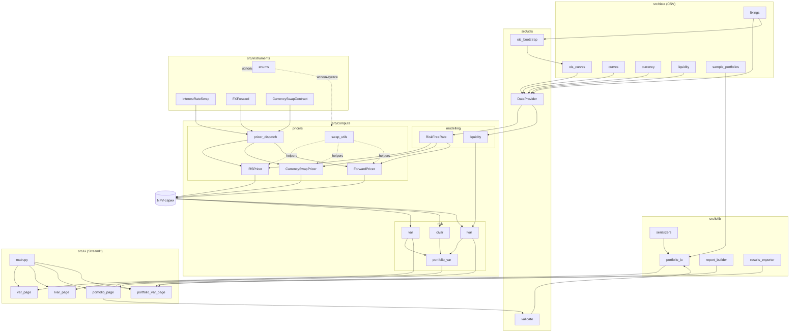

# course_work_risk_calc

## Что это

Калькулятор финансового риска для портфеля внебиржевых процентных и валютных деривативов. Поддерживаются процентные свопы (IRS), валютные форварды (FX forward) и валютные свопы (FX swap, currency swap). Файлы под кросс-валютные свопы (`XCCY`) и опционы Cap/Floor зарезервированы в `src/instruments/`, но прайсеры под них пока не реализованы. Каждый поддерживаемый инструмент оценивается как ежедневный временной ряд чистой приведённой стоимости (NPV), после чего на агрегированном P&L портфеля рассчитываются метрики риска: исторический VaR, параметрический VaR/ES, Component VaR, Incremental VaR и Liquidity-adjusted VaR (LVaR).

Пользовательский интерфейс реализован на Streamlit, точка входа `src/main.py`. Приложение многостраничное: страница расчёта VaR одного инструмента, страница LVaR с настройкой моделей ликвидности, страница работы с портфелем и страница портфельного VaR с iVaR/CVaR-разложением и P&L-аналитикой.

Проект разрабатывается как курсовая работа на ФКН ВШЭ. Помимо исходного кода в репозитории лежат сопутствующие материалы: ТЗ, ПЗ, ПМИ, ПО (папки `TZGeneration`, `PZGeneration`, `PMIGeneration`, `POGeneration`), контрольные точки `KT1`/`KT2`, дополнительные документы в `docs/` и `final_docs/`.

## Для чего используется

Сценариев применения два. Первый — посчитать рыночный риск отдельной сделки или портфеля сделок при заданных горизонте и доверительном уровне, опираясь на исторические рыночные данные (фиксинги, ZC-кривые, OIS-кривые, спот-курсы, спреды ликвидности), которые лежат в `src/data/`. Второй — продемонстрировать архитектуру мульти-кривого ценообразования (OIS-дисконтирование с rolling basis для IBOR-индексов) и связку оценки с метриками риска на одном дашборде.

## Архитектура и поток данных

Ниже схема взаимодействия модулей и потока данных от CSV-файлов до отображения метрик риска в UI.



## Структура репозитория

| Путь | Назначение |
|---|---|
| `src/main.py` | Точка входа Streamlit |
| `src/instruments/` | Датаклассы контрактов и общие enum'ы |
| `src/compute/pricers/` | Прайсеры IRS, FX swap, FX forward и общий swap_utils |
| `src/compute/risk/` | VaR, CVaR, LVaR, агрегация на портфель |
| `src/compute/modelling/` | Интерполяция ZC-кривых и модели ликвидности |
| `src/utils/` | DataProvider, OIS-bootstrap, валидация, генераторы данных |
| `src/iolib/` | Загрузка/сохранение портфелей, отчёты, экспорт результатов |
| `src/iolib/serializers/` | YAML/JSON/CSV/Excel реализации сериализаторов |
| `src/ui/` | Страницы Streamlit |
| `src/data/` | Рыночные данные (CSV) |
| `src/backtest/` | Заготовка под бэктест |
| `tests/` | Юнит- и интеграционные тесты pytest |
| `docs/`, `final_docs/`, `gost_stuff/` | Документация |
| `TZGeneration/`, `PZGeneration/`, `PMIGeneration/`, `POGeneration/`, `KT1/`, `KT2/`, `TPGeneration/` | Артефакты курсовой |

## Как собрать и запустить

### Способ 1. Локальный запуск через Streamlit

Требуется Python 3.11. Из корня репозитория создаётся виртуальное окружение и ставятся зависимости из `requirements.txt`, после чего Streamlit запускается из директории `src/`.

```bash
python3.11 -m venv venv
source venv/bin/activate
pip install -r requirements.txt
cd src
streamlit run main.py
```

После старта приложение доступно на `http://localhost:8501`.

### Способ 2. Запуск тестов

`tests/conftest.py` сам добавляет каталог `src/` в `sys.path` через `os.path.dirname(__file__)`, поэтому тесты находят пакеты проекта при запуске из любой директории. Удобный пример:

```bash
cd src
../venv/bin/pytest ../tests/ -v
```

Эквивалентно работает `pytest tests/ -v` из корня репозитория.

#### Результаты тестирования

Зафиксированный лог выполнения полного набора автотестов (с привязкой групп тестов к функциональным требованиям ТЗ во входной части) лежит в корне репозитория в файле [`pytest_results.txt`](pytest_results.txt). Текущее состояние: **103 passed, 0 failed**. Этот файл служит подтверждением прохождения автоматизированных проверок для документа «Программа и методика испытаний» (ПМИ).

Чтобы обновить лог после изменений в коде, достаточно перезапустить тесты с перенаправлением вывода:

```bash
pytest tests/ -v --tb=short > pytest_results.txt
```

### Способ 3. Docker и docker-compose

В репозитории лежит `Dockerfile` (Python 3.11 slim, ставит зависимости и запускает Streamlit на порту 8501) и `docker-compose.yml`, который поднимает три инстанса Streamlit (`streamlit1`, `streamlit2`, `streamlit3`) за nginx-апстримом на порту 80. Балансировщик использует `ip_hash` (sticky sessions), потому что Streamlit держит сессию в памяти процесса. Каталоги с рыночными данными (`currency`, `curves`, `fixings`, `ois_curves`, `ir`, `sample_portfolios`) монтируются в каждый контейнер в режиме read-only. Каталог `src/data/liquidity/` намеренно не монтируется: данные о спредах ликвидности подгружаются пользователем непосредственно в UI на странице LVaR (загрузка CSV или параметрический ввод модели).

```bash
docker compose up --build
```

После старта приложение доступно на `http://localhost`. Healthcheck каждого инстанса опирается на эндпоинт `/_stcore/health`.

Если нужен только один контейнер без балансировщика, образ можно собрать и запустить напрямую.

```bash
docker build -t risk-calc .
docker run --rm -p 8501:8501 \
  -v "$PWD/src/data":/app/src/data:ro \
  risk-calc
```

## Подробности по подпакетам

В каждой папке репозитория, содержащей код, лежит свой `README.md` с описанием конкретных классов, функций и их роли в общей цепочке. Для навигации удобно начинать с `src/README.md`, далее переходить в `src/compute/README.md` и оттуда в pricers/risk/modelling.

## Замечания по модели IRS

Прайсер процентного свопа использует две схемы для плавающей ноги. Для индексов, у которых `FloatingIndex.is_ois_based` равно True (RUONIA, ESTR, SOFR, RUSFARCNY), применяется тождество par-float через дисконт-факторы OIS. Для остальных IBOR-индексов (EURIBOR, RUSFAR, RUB_KEY_RATE) форвард строится как OIS-форвард соответствующего срока плюс rolling-mean базис между историческим фиксингом индекса и OIS-ставкой (окно 20 дней). Дисконтирование во всех случаях единое — по OIS-кривой соответствующей валюты.
